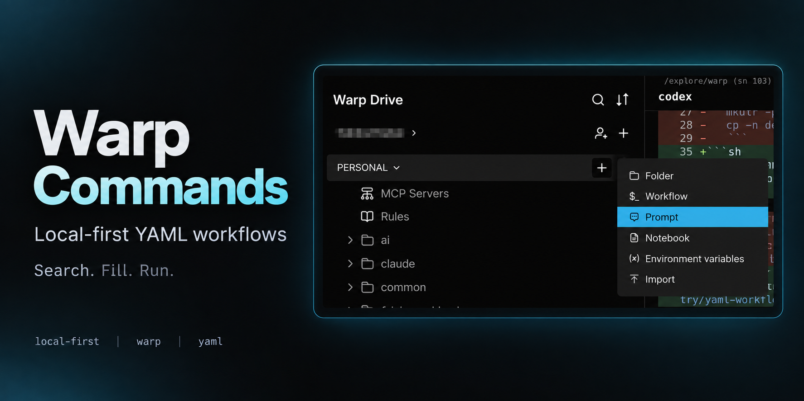
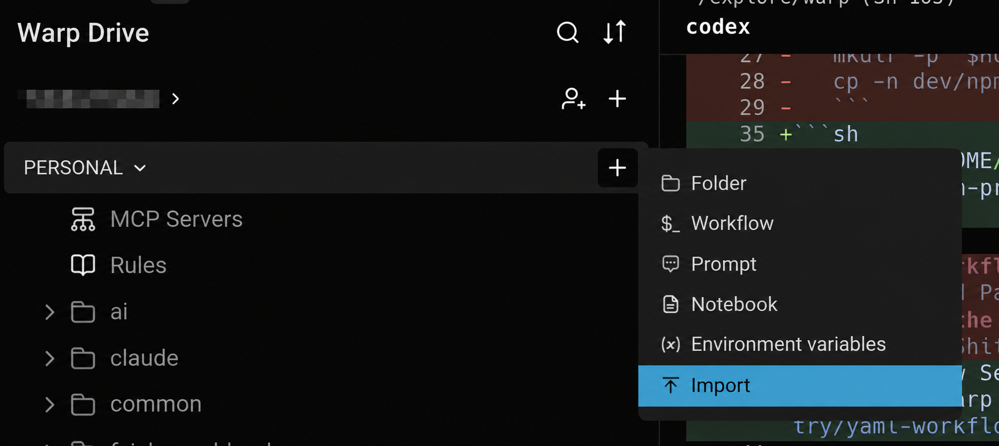

# Warp Commands

English · [简体中文](README.zh-CN.md) · [日本語](README.ja.md)

**Commands I use in Warp. Maybe you'll find them useful too.**



[local-first](https://github.com/topics/local-first) · [warp](https://github.com/topics/warp) · [yaml](https://github.com/topics/yaml)

## You might need these

- **macOS Caps Lock delay** — [mac caps delay](mac/mac-caps-delay.yaml): one `hidutil` command fixed this on my Mac.
- **Open an iCloud Obsidian vault** — [obsidian](mac/obsidian.yaml): run the `cd` command directly, or [install `cnotes`](setup/) for a short command on each Mac.
- **A project overview with eza** — [projects](mac/projects.yaml): [install once](setup/), then use `projects` to see project names, Git branches, and status together. Defaults to `~/codex`; accepts your own projects directory.

## Try them

1. **Clone**

   ```sh
   git clone https://github.com/yuukiLike/warp-commands.git
   ```

2. **Import** — Open Warp Drive → personal workspace **+ → Import**. Inside the cloned `warp-commands/` folder, select the `.yaml` files you want or a command folder such as `mac/` or `git/`. **Do not select the repository's top-level folder.**
3. **Use** — Search for a command such as `mac clipboard`, select it, fill in the arguments, and run.

`assets/` contains README images; Markdown files and `notes/` are documentation. **Leave these out of the import.** The YAML files in `setup/` are installation workflows; import the ones you need.



Warp Drive imports a synced copy. Keep the repository YAML as your source. [Import guide →](https://docs.warp.dev/knowledge-and-collaboration/warp-drive/#importing-files-into-warp-drive)

## Pick what you need

| Folder | Contents |
| --- | --- |
| [mac](mac/) | Clipboard, DNS, Caps Lock, Zsh config, Obsidian, project overview |
| [setup](setup/) | Run once in Warp: install `cnotes` and eza-based `projects`, loaded by `.zshrc` |
| [git](git/) | Git operations, ignore rules, SSH |
| [claude](claude/) | Claude Code installation, API switching, environment reset |
| [ai](ai/) | Codex and Gemini |
| [browser](browser/) | Chrome cache, certificate debugging, Puppeteer |
| [dev](dev/) | npm, Whistle, Rust, Vue |
| [system](system/) | Public IP and Windows utilities |
| [notes](notes/) | Git, SSH, and shell references |

Windows workflows use PowerShell or Git Bash; check each workflow's description.

## Install shell commands once

Import the YAML files in `setup/`. On each Mac, search in Warp for **`setup obsidian`** or **`setup projects`**, select the workflow, and run it. No repository path is required.

The workflows save command definitions under `~/.config/warp-commands/`, add a `source` line to `.zshrc`, and load the commands into the current terminal. `setup projects` also installs missing `eza` through Homebrew. Then use `cnotes` or `projects "$HOME/explore"`; the `projects` YAML also calls this installed function.

To update, refresh the corresponding workflow in Warp and run it again on each Mac. Existing `.zshrc` settings are preserved, and the loading line is not duplicated. See [setup](setup/) for details.

## Local use

To load YAML directly from local files, copy the workflows you need into:

| Platform | Directory |
| --- | --- |
| macOS | `$HOME/.warp/workflows/` |
| Windows (PowerShell) | `$env:APPDATA\warp\Warp\data\workflows\` |

Open Workflow Search in Warp to find them. Update your copies when the source changes. [YAML workflow guide →](https://docs.warp.dev/terminal/entry/yaml-workflows)
